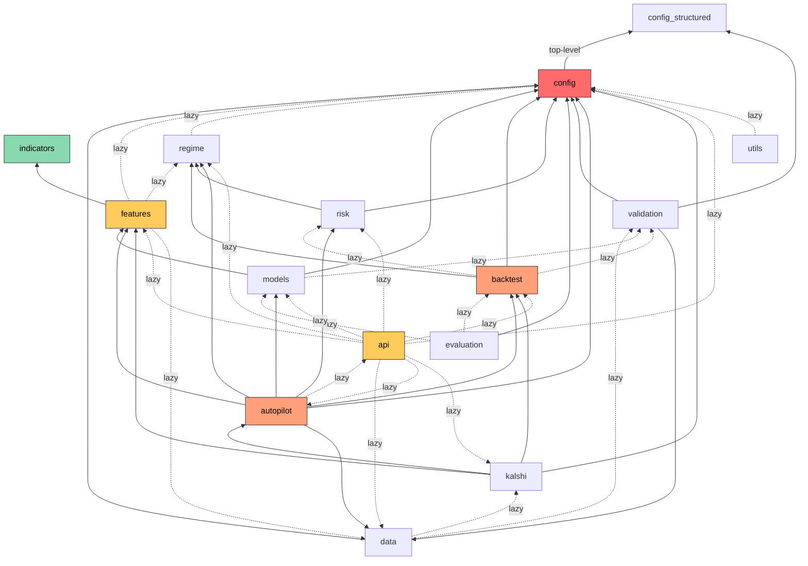

# Architecture & Dependency Map

**Generated**: 2026-02-27
**Scope**: Complete module inventory, dependency matrix, cross-module edges, and shared artifacts for the `quant_engine` system.
**Verification Method**: Every dependency was traced from actual Python source imports (`from quant_engine.*` absolute and `from ..module` relative patterns), including lazy imports inside function bodies.

---

## Module Inventory

### 1. config (Shared Infrastructure)

```yaml
module: config
path: config.py, config_structured.py, config_data/
purpose: >
  Central configuration layer. config.py provides ~150+ flat constants consumed
  by 13 of 14 modules. config_structured.py provides typed dataclass hierarchy
  (SystemConfig) as the authoritative source. config.py derives structured values
  via _cfg = _get_config().
file_count: 3
key_files:
  - path: config.py
    role: Flat constant exports consumed system-wide
    lines: 1020
  - path: config_structured.py
    role: Typed dataclass config hierarchy (authoritative source)
    lines: 347
  - path: config_data/__init__.py
    role: YAML config data directory marker
    lines: 1
public_interface:
  - "200+ constants (UNIVERSE_FULL, MODEL_PARAMS, REGIME_*, EXEC_*, PROMOTION_*, etc.)"
  - validate_config() → list
  - get_config() → SystemConfig (from config_structured)
  - PreconditionsConfig, DataConfig, RegimeConfig, ModelConfig, BacktestConfig, etc. (14 dataclasses)
internal_only:
  - _get_config (aliased singleton accessor)
  - _yaml (transient yaml import)
```

### 2. data (Data Ingestion & Quality)

```yaml
module: data
path: data/
purpose: >
  Provider-abstracted data loading, caching, quality assessment, survivorship
  bias controls, alternative data, and intraday quality validation.
file_count: 15
key_files:
  - path: data/loader.py
    role: Primary data loading interface (load_universe, load_ohlcv)
    lines: 849
  - path: data/local_cache.py
    role: Parquet-based local cache with metadata sidecars
    lines: 841
  - path: data/quality.py
    role: OHLCV quality assessment and degradation flagging
    lines: 386
  - path: data/survivorship.py
    role: Survivorship bias controls and point-in-time universe tracking
    lines: 945
  - path: data/wrds_provider.py
    role: WRDS/CRSP/Compustat data provider
    lines: 1620
  - path: data/intraday_quality.py
    role: 13-point intraday data quality validation
    lines: 1110
  - path: data/cross_source_validator.py
    role: Cross-source validation (IBKR vs Alpaca/AV)
    lines: 743
  - path: data/alternative.py
    role: WRDS-backed alternative data (earnings, fundamentals, short interest, options flow)
    lines: 960
  - path: data/feature_store.py
    role: Point-in-time feature store
    lines: 342
  - path: data/provider_base.py
    role: DataProvider protocol definition
    lines: 15
  - path: data/provider_registry.py
    role: Provider factory with lazy loading
    lines: 54
  - path: data/providers/alpaca_provider.py
    role: Alpaca Markets data provider
    lines: 361
  - path: data/providers/alpha_vantage_provider.py
    role: Alpha Vantage data provider
    lines: 415
public_interface:
  - load_ohlcv, load_universe, load_survivorship_universe, load_with_delistings
  - save_ohlcv, load_ibkr_data, list_cached_tickers, cache_universe
  - get_provider, list_providers, register_provider
  - DataQualityReport, assess_ohlcv_quality, check_ohlc_relationships, generate_quality_report, flag_degraded_stocks
  - FeatureStore
  - DataProvider (Protocol)
  - SurvivorshipBiasController, DelistingHandler, filter_panel_by_point_in_time_universe
  - CrossSourceValidator
internal_only:
  - load_ohlcv_with_meta (used by loader.py)
  - rehydrate_cache_metadata, backfill_terminal_metadata
```

### 3. features (Feature Engineering)

```yaml
module: features
path: features/
purpose: >
  Computes 90+ features from OHLCV data. FeaturePipeline is the central
  orchestrator importing 50+ indicators, config constants, and lazy-loading
  regime, data, and advanced indicator modules.
file_count: 10
key_files:
  - path: features/pipeline.py
    role: Central feature computation pipeline (90+ features)
    lines: 1541
  - path: features/research_factors.py
    role: Advanced research factors (order flow, DTW, signatures)
    lines: 985
  - path: features/options_factors.py
    role: Option surface and IV shock features
    lines: 135
  - path: features/intraday.py
    role: Microstructure features from intraday data
    lines: 244
  - path: features/macro.py
    role: FRED-sourced macroeconomic features
    lines: 245
  - path: features/version.py
    role: Feature versioning registry
    lines: 169
  - path: features/lob_features.py
    role: Limit order book proxy features
    lines: 312
  - path: features/harx_spillovers.py
    role: HARX cross-market volatility spillover
    lines: 243
  - path: features/wave_flow.py
    role: Flow/wave spectral decomposition
    lines: 145
public_interface:
  - FeaturePipeline.compute_universe() (main entry point)
  - FEATURE_METADATA, get_feature_type
  - compute_option_surface_factors, compute_iv_shock_features
  - compute_intraday_features, compute_rolling_vwap
  - MacroFeatureProvider
  - FeatureVersion, FeatureRegistry
internal_only:
  - compute_lob_features_batch, compute_harx_spillovers, compute_wave_flow_decomposition
  - ResearchFactorConfig, compute_single_asset_research_factors
```

### 4. indicators (Technical Indicators)

```yaml
module: indicators
path: indicators/
purpose: >
  Self-contained technical indicator library. 60+ indicator classes plus
  advanced analyzers (spectral, eigenvalue, SSA, optimal transport, tail risk).
  Zero internal dependencies — used only by features/pipeline.py.
file_count: 7
key_files:
  - path: indicators/indicators.py
    role: Base Indicator class and 60+ subclasses (ATR, RSI, MACD, etc.)
    lines: 2904
  - path: indicators/spectral.py
    role: Spectral energy, entropy, bandwidth analysis
    lines: 329
  - path: indicators/eigenvalue.py
    role: Eigenvalue concentration, effective rank, correlation stress
    lines: 400
  - path: indicators/ssa.py
    role: Singular Spectrum Analysis decomposition
    lines: 322
  - path: indicators/ot_divergence.py
    role: Optimal transport (Wasserstein, Sinkhorn) divergence
    lines: 263
  - path: indicators/tail_risk.py
    role: Jump intensity, expected shortfall, vol-of-vol
    lines: 241
public_interface:
  - Indicator (base class), 60+ indicator subclasses
  - SpectralAnalyzer, EigenvalueAnalyzer, SSADecomposer, OptimalTransportAnalyzer, TailRiskAnalyzer
internal_only: []
```

### 5. regime (Regime Detection)

```yaml
module: regime
path: regime/
purpose: >
  Multi-model regime detection (HMM, jump model, BOCPD, correlation).
  Confidence-weighted ensemble with uncertainty gating, online updates,
  cross-sectional consensus, and shock vector representation.
file_count: 13
key_files:
  - path: regime/detector.py
    role: Main RegimeDetector orchestrating HMM, jump, BOCPD, ensemble
    lines: 940
  - path: regime/hmm.py
    role: Custom Gaussian HMM implementation with BIC selection
    lines: 662
  - path: regime/shock_vector.py
    role: Unified structural state representation (ShockVector dataclass)
    lines: 495
  - path: regime/bocpd.py
    role: Bayesian Online Change-Point Detection
    lines: 452
  - path: regime/jump_model_pypi.py
    role: PyPI jumpmodels package wrapper
    lines: 421
  - path: regime/consensus.py
    role: Cross-sectional regime consensus
    lines: 274
  - path: regime/uncertainty_gate.py
    role: Entropy-based position sizing modifier
    lines: 181
  - path: regime/online_update.py
    role: Online HMM regime updates via forward algorithm
    lines: 246
  - path: regime/confidence_calibrator.py
    role: Ensemble confidence calibration
    lines: 252
  - path: regime/correlation.py
    role: Correlation regime detection
    lines: 214
  - path: regime/jump_model_legacy.py
    role: Legacy statistical jump model
    lines: 243
  - path: regime/jump_model.py
    role: Backward-compatibility re-export
    lines: 10
public_interface:
  - RegimeDetector, RegimeOutput, detect_regimes_batch, validate_hmm_observation_features
  - GaussianHMM, HMMFitResult, build_hmm_observation_matrix, map_raw_states_to_regimes
  - ShockVector, ShockVectorValidator, compute_shock_vectors
  - UncertaintyGate
  - BOCPDDetector, BOCPDResult, BOCPDBatchResult
  - RegimeConsensus
  - CorrelationRegimeDetector
  - ConfidenceCalibrator
  - OnlineRegimeUpdater
  - StatisticalJumpModel, JumpModelResult, PyPIJumpModel
internal_only:
  - _logsumexp (hmm.py helper)
```

### 6. models (Model Training & Prediction)

```yaml
module: models
path: models/
purpose: >
  Ensemble model training (GBR, ElasticNet, optional neural net), prediction
  with regime blending, versioning, governance, conformal prediction,
  walk-forward selection, and retrain triggers.
file_count: 16
key_files:
  - path: models/trainer.py
    role: EnsembleTrainer — trains regime-aware model ensemble
    lines: 1818
  - path: models/predictor.py
    role: EnsemblePredictor — prediction with regime blending and conformal intervals
    lines: 539
  - path: models/iv/models.py
    role: Black-Scholes, Heston, SVI, arbitrage-free surface builder
    lines: 937
  - path: models/walk_forward.py
    role: Walk-forward hyperparameter selection
    lines: 236
  - path: models/versioning.py
    role: Model version registry and artifact management
    lines: 208
  - path: models/feature_stability.py
    role: Feature importance stability tracking
    lines: 314
  - path: models/shift_detection.py
    role: CUSUM and PSI distribution shift detection
    lines: 323
  - path: models/retrain_trigger.py
    role: Automated retrain trigger logic
    lines: 345
  - path: models/governance.py
    role: Champion/challenger model governance
    lines: 156
  - path: models/calibration.py
    role: Confidence calibration (isotonic/Platt)
    lines: 328
  - path: models/conformal.py
    role: Conformal prediction intervals
    lines: 296
  - path: models/online_learning.py
    role: Online model weight updates
    lines: 274
  - path: models/neural_net.py
    role: Optional PyTorch TabularNet
    lines: 199
  - path: models/cross_sectional.py
    role: Cross-sectional rank transformation
    lines: 137
public_interface:
  - ModelTrainer (trainer.py)
  - EnsemblePredictor (predictor.py)
  - ModelRegistry, ModelVersion (versioning.py)
  - ModelGovernance, ChampionRecord (governance.py)
  - ConfidenceCalibrator, compute_ece, compute_reliability_curve (calibration.py)
  - ConformalPredictor (conformal.py)
  - walk_forward_select (walk_forward.py)
  - FeatureStabilityTracker, StabilityReport (feature_stability.py)
  - DistributionShiftDetector (shift_detection.py)
  - RetrainTrigger (retrain_trigger.py)
  - cross_sectional_rank (cross_sectional.py)
  - TabularNet (neural_net.py)
  - OnlineLearner, OnlineUpdate (online_learning.py)
  - BlackScholes, HestonModel, SVIModel, ArbitrageFreeSVIBuilder, IVSurface (iv/)
internal_only:
  - _LinearRescaler (calibration.py fallback)
```

### 7. backtest (Backtesting Engine)

```yaml
module: backtest
path: backtest/
purpose: >
  Execution-aware trade simulation with dynamic costs, structural state
  awareness, validation (walk-forward, CPCV, SPA), and advanced
  validation (DSR, PBO, Monte Carlo, capacity).
file_count: 11
key_files:
  - path: backtest/engine.py
    role: Core Backtester — simulation loop, signal-to-trade, result output
    lines: 2488
  - path: backtest/validation.py
    role: Walk-forward, CPCV, SPA, IC rolling/decay
    lines: 1074
  - path: backtest/execution.py
    role: ExecutionModel with structural-state-aware cost modeling
    lines: 936
  - path: backtest/cost_calibrator.py
    role: Adaptive cost calibration from realized fills
    lines: 685
  - path: backtest/advanced_validation.py
    role: Deflated Sharpe, PBO, Monte Carlo, capacity analysis
    lines: 665
  - path: backtest/null_models.py
    role: Random/zero/momentum null baselines
    lines: 297
  - path: backtest/cost_stress.py
    role: Cost sensitivity sweep testing
    lines: 222
  - path: backtest/optimal_execution.py
    role: Almgren-Chriss trajectory optimization
    lines: 201
  - path: backtest/adv_tracker.py
    role: Average daily volume tracking
    lines: 191
  - path: backtest/survivorship_comparison.py
    role: Survivorship bias impact comparison
    lines: 164
public_interface:
  - Backtester, BacktestResult, Trade (engine.py)
  - ExecutionModel, ExecutionFill, ShockModePolicy (execution.py)
  - CostCalibrator (cost_calibrator.py)
  - walk_forward_validate, run_statistical_tests, combinatorial_purged_cv, superior_predictive_ability
  - walk_forward_with_embargo, rolling_ic, detect_ic_decay
  - deflated_sharpe_ratio, probability_of_backtest_overfitting, monte_carlo_validation, capacity_analysis
  - CostStressTester (cost_stress.py)
  - almgren_chriss_trajectory, estimate_execution_cost (optimal_execution.py)
  - ADVTracker (adv_tracker.py)
  - compute_null_baselines (null_models.py)
  - compare_survivorship_impact (survivorship_comparison.py)
internal_only:
  - _NormFallback, _StatsFallback (scipy fallbacks)
```

### 8. risk (Risk Management)

```yaml
module: risk
path: risk/
purpose: >
  Reusable risk sizing, portfolio constraints, stop-loss, drawdown control,
  covariance estimation, portfolio optimization, factor exposures, attribution,
  stress testing, and cost budgeting.
file_count: 16
key_files:
  - path: risk/position_sizer.py
    role: Kelly-based position sizing with uncertainty gate integration
    lines: 1254
  - path: risk/portfolio_risk.py
    role: Portfolio-level risk constraints and factor exposure bounds
    lines: 885
  - path: risk/stress_test.py
    role: Scenario, historical drawdown, correlation, and factor stress tests
    lines: 548
  - path: risk/covariance.py
    role: Ledoit-Wolf shrinkage and regime-conditional covariance
    lines: 356
  - path: risk/drawdown.py
    role: Drawdown monitoring with warning/caution/critical states
    lines: 261
  - path: risk/stop_loss.py
    role: Multi-strategy stop-loss (hard, ATR, trailing, regime-adjusted)
    lines: 294
  - path: risk/metrics.py
    role: Comprehensive risk reporting (Sharpe, Sortino, VaR, CVaR)
    lines: 321
  - path: risk/portfolio_optimizer.py
    role: Mean-variance portfolio optimization with sector constraints
    lines: 280
  - path: risk/factor_monitor.py
    role: Factor exposure monitoring and alerts
    lines: 301
  - path: risk/factor_exposures.py
    role: Factor exposure management with universe-aware bounds
    lines: 269
  - path: risk/attribution.py
    role: Return decomposition and attribution analysis
    lines: 369
  - path: risk/universe_config.py
    role: YAML-based universe configuration loader
    lines: 296
  - path: risk/factor_portfolio.py
    role: Factor exposure computation and residual returns
    lines: 221
  - path: risk/cost_budget.py
    role: Rebalance cost optimization
    lines: 222
  - path: risk/constraint_replay.py
    role: Stress constraint replay and robustness scoring
    lines: 198
public_interface:
  - PositionSizer, PositionSize
  - PortfolioRiskManager, ConstraintMultiplier, RiskCheck
  - DrawdownController, DrawdownState, DrawdownStatus
  - StopLossManager, StopReason, StopResult
  - RiskMetrics, RiskReport
  - CovarianceEstimator, compute_regime_covariance, get_regime_covariance
  - optimize_portfolio
  - FactorExposureManager, FactorExposureMonitor
  - decompose_returns, compute_attribution_report, compute_rolling_attribution
  - run_stress_scenarios, run_historical_drawdown_test, correlation_stress_test, factor_stress_test
  - optimize_rebalance_cost
  - replay_with_stress_constraints, compute_robustness_score
  - UniverseConfig, ConfigError
internal_only:
  - _cornish_fisher_var (risk/metrics.py)
  - _estimate_beta, _estimate_factor_loadings (risk/attribution.py)
```

### 9. evaluation (Evaluation & Diagnostics)

```yaml
module: evaluation
path: evaluation/
purpose: >
  Model and strategy evaluation with regime-aware slicing, fragility metrics,
  calibration analysis, ML diagnostics, and interactive visualization.
file_count: 8
key_files:
  - path: evaluation/engine.py
    role: Main EvaluationEngine orchestrating all evaluation dimensions
    lines: 827
  - path: evaluation/fragility.py
    role: PnL concentration, drawdown distribution, critical slowing down
    lines: 453
  - path: evaluation/slicing.py
    role: Regime, volatility, and custom performance slicing
    lines: 401
  - path: evaluation/visualization.py
    role: Plotly-based interactive charts (regime, IC, calibration, etc.)
    lines: 387
  - path: evaluation/metrics.py
    role: Slice-level metric computation
    lines: 325
  - path: evaluation/ml_diagnostics.py
    role: Feature importance drift and ensemble disagreement
    lines: 254
  - path: evaluation/calibration_analysis.py
    role: Calibration quality analysis (ECE, reliability curves)
    lines: 143
public_interface:
  - EvaluationEngine, EvaluationResult, RedFlag
  - PerformanceSlice, SliceRegistry
  - compute_slice_metrics, decile_spread
  - pnl_concentration, drawdown_distribution, recovery_time_distribution, detect_critical_slowing_down
  - feature_importance_drift, ensemble_disagreement
  - analyze_calibration
internal_only:
  - plot_* functions (visualization.py — used only by engine.py)
```

### 10. validation (Validation)

```yaml
module: validation
path: validation/
purpose: >
  Data integrity validation, lookahead/leakage detection, feature redundancy
  checks, and execution contract preconditions.
file_count: 5
key_files:
  - path: validation/preconditions.py
    role: Execution contract enforcement (RET_TYPE, LABEL_H, PX_TYPE checks)
    lines: 72
  - path: validation/data_integrity.py
    role: OHLCV quality gate wrapping data.quality
    lines: 115
  - path: validation/leakage_detection.py
    role: Lookahead bias and leakage detection
    lines: 194
  - path: validation/feature_redundancy.py
    role: Feature correlation and redundancy detection
    lines: 115
public_interface:
  - validate_execution_contract, enforce_preconditions (preconditions.py)
  - DataIntegrityValidator, DataIntegrityCheckResult (data_integrity.py)
  - LeakageDetector, run_leakage_checks (leakage_detection.py)
  - FeatureRedundancyDetector, validate_structural_feature_composition (feature_redundancy.py)
internal_only: []
```

### 11. autopilot (Strategy Discovery)

```yaml
module: autopilot
path: autopilot/
purpose: >
  End-to-end strategy discovery: generates parameter variants, backtests them,
  applies promotion gates, manages registry, runs paper trading with execution
  realism, and applies meta-labeling.
file_count: 8
key_files:
  - path: autopilot/engine.py
    role: Main AutopilotEngine orchestrating the full discovery cycle
    lines: 1927
  - path: autopilot/paper_trader.py
    role: Stateful paper trading with execution model and health integration
    lines: 1254
  - path: autopilot/meta_labeler.py
    role: XGBoost secondary classifier for signal confidence
    lines: 469
  - path: autopilot/promotion_gate.py
    role: Hard risk/quality promotion constraints
    lines: 425
  - path: autopilot/strategy_allocator.py
    role: Regime-specific parameter blending
    lines: 197
  - path: autopilot/registry.py
    role: Promoted strategy state persistence
    lines: 111
  - path: autopilot/strategy_discovery.py
    role: Parameter variant grid generation
    lines: 80
public_interface:
  - AutopilotEngine (engine.py)
  - PaperTrader (paper_trader.py)
  - MetaLabelingModel (meta_labeler.py)
  - PromotionGate, PromotionDecision (promotion_gate.py)
  - StrategyDiscovery, StrategyCandidate (strategy_discovery.py)
  - StrategyRegistry, ActiveStrategy (registry.py)
  - StrategyAllocator, StrategyProfile (strategy_allocator.py)
internal_only:
  - HeuristicPredictor (engine.py fallback)
```

### 12. kalshi (Event Markets)

```yaml
module: kalshi
path: kalshi/
purpose: >
  Kalshi prediction market ingestion, DuckDB storage, distribution
  reconstruction, event feature materialization, walk-forward evaluation,
  and promotion integration.
file_count: 24 (16 source + 8 tests)
key_files:
  - path: kalshi/distribution.py
    role: Implied probability distribution reconstruction
    lines: 935
  - path: kalshi/client.py
    role: Authenticated Kalshi API client with rate limiting
    lines: 656
  - path: kalshi/provider.py
    role: High-level data provider wrapping client, storage, distribution
    lines: 648
  - path: kalshi/storage.py
    role: DuckDB/SQLite event-time store
    lines: 650
  - path: kalshi/events.py
    role: Event feature panel construction with strict as-of semantics
    lines: 518
  - path: kalshi/walkforward.py
    role: Event strategy walk-forward evaluation
    lines: 493
  - path: kalshi/pipeline.py
    role: End-to-end Kalshi pipeline orchestrator
    lines: 168
  - path: kalshi/quality.py
    role: Quote quality dimensions and stale filtering
    lines: 207
  - path: kalshi/promotion.py
    role: Event strategy promotion via PromotionGate integration
    lines: 178
public_interface:
  - KalshiClient, KalshiProvider, KalshiPipeline, KalshiDataRouter
  - EventTimeStore
  - DistributionConfig, build_distribution_panel
  - EventFeatureConfig, build_event_feature_panel, build_event_labels, asof_join
  - EventWalkForwardConfig, run_event_walkforward, evaluate_event_contract_metrics
  - EventPromotionConfig, evaluate_event_promotion
  - QualityDimensions, StalePolicy
  - EventMarketMappingStore
internal_only:
  - KalshiSigner, RequestLimiter, RetryPolicy, RateLimitPolicy (client.py internals)
  - MicrostructureDiagnostics, DisagreementSignals, EventRegimeTag
```

### 13. api (FastAPI Web Stack)

```yaml
module: api
path: api/
purpose: >
  FastAPI backend serving the React frontend. Thin routers → service adapters
  → core engine. Background job system (SQLite + SSE), in-memory TTL cache,
  and dependency injection.
file_count: 42
key_files:
  - path: api/services/health_service.py
    role: Comprehensive health monitoring service
    lines: 2929
  - path: api/services/data_helpers.py
    role: Shared data loading and metric computation helpers
    lines: 1058
  - path: api/ab_testing.py
    role: A/B testing framework for strategy variants
    lines: 795
  - path: api/orchestrator.py
    role: Pipeline orchestrator for API job execution
    lines: 373
  - path: api/main.py
    role: FastAPI app creation and lifecycle
    lines: 149
  - path: api/routers/data_explorer.py
    role: Data browsing and indicator endpoints
    lines: 491
  - path: api/services/health_alerts.py
    role: Health alert management and webhook notification
    lines: 325
  - path: api/services/health_confidence.py
    role: Bayesian confidence interval calculation
    lines: 315
  - path: api/services/health_risk_feedback.py
    role: Health-risk feedback gate for paper trading
    lines: 276
  - path: api/services/data_service.py
    role: Universe and data status adapters
    lines: 209
public_interface:
  - create_app, run_server (main.py)
  - ApiResponse, ResponseMeta (schemas/envelope.py)
  - ApiSettings, RuntimeConfig (config.py)
  - JobStore, JobRunner, JobRecord, JobStatus (jobs/)
  - CacheManager (cache/manager.py)
  - ABTestRegistry, ABTest, ABVariant (ab_testing.py)
  - PipelineOrchestrator (orchestrator.py)
  - 48 mounted API endpoints across 15 routers
internal_only:
  - All service classes (autopilot_service, backtest_service, etc.)
  - Router internals, cache invalidation hooks
```

### 14. utils (Utilities)

```yaml
module: utils
path: utils/
purpose: >
  Structured logging, alert history with webhook notification, and metrics
  emission.
file_count: 2
key_files:
  - path: utils/logging.py
    role: Structured JSON logging, AlertHistory, MetricsEmitter
    lines: 439
public_interface:
  - get_logger (factory)
  - StructuredFormatter
  - AlertHistory
  - MetricsEmitter
internal_only: []
```

### 15. Root Scripts & Entry Points

```yaml
module: scripts
path: run_*.py, scripts/
purpose: >
  CLI entry points for training, prediction, backtesting, autopilot,
  retraining, server launch, Kalshi pipeline, WRDS refresh, and data scripts.
file_count: 16
key_files:
  - path: run_train.py
    role: CLI model training entry point
    lines: 228
  - path: run_backtest.py
    role: CLI backtesting entry point
    lines: 465
  - path: run_predict.py
    role: CLI prediction entry point
    lines: 238
  - path: run_autopilot.py
    role: CLI autopilot cycle entry point
    lines: 130
  - path: run_retrain.py
    role: CLI automated retraining with trigger logic
    lines: 323
  - path: run_server.py
    role: FastAPI server launcher
    lines: 95
  - path: run_kalshi_event_pipeline.py
    role: Kalshi end-to-end pipeline runner
    lines: 228
  - path: run_wrds_daily_refresh.py
    role: Daily WRDS data refresh and cache update
    lines: 915
  - path: run_wrds_taq_intraday_download.py
    role: NYSE TAQ Daily Product intraday OHLCV download (2003-present, 128 tickers, 6 timeframes)
    lines: 680
  - path: run_intraday_indicators.py
    role: Compute and cache 14 intraday microstructure indicators from cached TAQ OHLCV bars into feature store
    lines: 460
  - path: run_rehydrate_cache_metadata.py
    role: Cache metadata repair utility
    lines: 102
  - path: scripts/alpaca_intraday_download.py
    role: Alpaca/IBKR intraday data downloader
    lines: 1202
  - path: reproducibility.py
    role: Run manifest building, verification, and replay
    lines: 333
public_interface:
  - main() in each run_*.py
  - build_run_manifest, write_run_manifest, verify_manifest, replay_manifest (reproducibility.py)
internal_only: []
```

---

## Dependency Matrix (Verified)

Each `✓` indicates at least one file in the row module imports from the column module. `(L)` = lazy/conditional imports only.

```
                 config  data  features  indicators  regime  models  backtest  risk  evaluation  validation  autopilot  kalshi  api  utils  config_structured
config             -      -      -         -          -       -        -        -       -           -           -         -      -     -         ✓
data               ✓      -      -         -          -       -        -        -       -           ✓(L)        -         ✓(L)   -     -         -
features           ✓(L)   ✓(L)   -         ✓          ✓(L)    -        -        -       -           -           -         -      -     -         -
indicators         -      -      -         -          -       -        -        -       -           -           -         -      -     -         -
regime             ✓(L)   -      -         -          -       -        -        -       -           -           -         -      -     -         -
models             ✓      -      ✓         -          -       -        -        -       -           ✓(L)        -         -      -     -         -
backtest           ✓      -      -         -          ✓       -        -        ✓(L)    -           ✓(L)        -         -      -     -         -
risk               ✓      -      -         -          ✓       -        -        -       -           -           -         -      -     -         -
evaluation         ✓      -      -         -          -       ✓(L)     ✓(L)     -       -           -           -         -      -     -         -
validation         ✓      ✓      -         -          -       -        -        -       -           -           -         -      -     -         ✓
autopilot          ✓      ✓      ✓         -          ✓       ✓        ✓        ✓       -           -           -         -      ✓(L)  -         -
kalshi             ✓      -      ✓         -          -       -        ✓        -       -           -           ✓         -      -     -         -
api                ✓(L)   ✓(L)   ✓(L)      -          ✓(L)    ✓(L)     ✓(L)     ✓(L)   -           -           ✓(L)      ✓(L)   -     -         -
utils              ✓(L)   -      -         -          -       -        -        -       -           -           -         -      -     -         -
run_*.py/scripts   ✓      ✓      ✓         -          ✓       ✓        ✓        -       -           -           ✓         ✓      ✓     -         -
```

### Discrepancies from Spec's Initial Matrix

| Cell | Spec Claimed | Actual | Explanation |
|------|-------------|--------|-------------|
| api → (all) | No dependencies | 10 module dependencies | API uses lazy imports in services/orchestrator/routers to access all core modules |
| features → data | ✓ | ✓ (lazy) | Confirmed: pipeline.py lazily imports data.wrds_provider, data.local_cache, data.loader |
| features → regime | ✓ | ✓ (lazy) | Confirmed: pipeline.py lazily imports regime.correlation |
| backtest → risk | ✓ | ✓ (lazy) | Confirmed: engine.py lazily imports 5 risk files inside run() method |
| config → config_structured | not shown | ✓ | config.py imports get_config from config_structured at top-level |
| validation → config_structured | not shown | ✓ | preconditions.py imports PreconditionsConfig from config_structured |

---

## Module-to-Module Dependency Flowchart

Arrow direction: A ---> B means "A depends on B" (A imports from B).



---

## Shared Artifact Table (Verified)

| Artifact | Writer(s) | Reader(s) | Format | Schema Owner |
|----------|-----------|-----------|--------|-------------|
| `trained_models/ensemble_{H}d/` | models/trainer.py | models/predictor.py, api/services/model_service.py | joblib + JSON metadata | models/versioning.py |
| `trained_models/ensemble_{H}d_meta.json` | models/trainer.py | models/predictor.py, api/services/model_service.py | JSON | models/trainer.py |
| `trained_models/meta_labeler/` | autopilot/meta_labeler.py | autopilot/meta_labeler.py | joblib | autopilot/meta_labeler.py |
| `results/backtest_{H}d_summary.json` | backtest/engine.py | api/services/backtest_service.py, evaluation/engine.py | JSON | backtest/engine.py |
| `results/backtest_{H}d_trades.csv` | backtest/engine.py | api/services/backtest_service.py, api/services/data_helpers.py | CSV | backtest/engine.py |
| `results/predictions_{H}d.csv` | models/predictor.py, run_predict.py | api/services/results_service.py | CSV | models/predictor.py |
| `results/autopilot/strategy_registry.json` | autopilot/registry.py | api/services/autopilot_service.py | JSON | autopilot/registry.py |
| `results/autopilot/paper_state.json` | autopilot/paper_trader.py | api/services/autopilot_service.py | JSON | autopilot/paper_trader.py |
| `results/autopilot/latest_cycle.json` | autopilot/engine.py | api/services/autopilot_service.py | JSON | autopilot/engine.py |
| `results/feature_stability_history.json` | models/feature_stability.py | api/services/model_service.py | JSON | models/feature_stability.py |
| `results/champion_registry.json` | models/governance.py | models/predictor.py, api/services/model_service.py | JSON | models/governance.py |
| `data/cache/*.parquet` | data/local_cache.py | data/loader.py | Parquet + JSON sidecar | data/local_cache.py |
| `data/cache/quarantine/` | data/intraday_quality.py | data/intraday_quality.py | JSON reports | data/intraday_quality.py |
| `data/kalshi.duckdb` | kalshi/storage.py | kalshi/pipeline.py, kalshi/events.py, kalshi/provider.py | DuckDB (SQLite fallback) | kalshi/storage.py |
| `api_jobs.db` | api/jobs/store.py | api/jobs/runner.py, api/routers/jobs.py | SQLite | api/jobs/store.py |
| `config_data/universe.yaml` | run_wrds_daily_refresh.py | config.py, risk/universe_config.py | YAML | run_wrds_daily_refresh.py |
| `results/health/alert_history.json` | utils/logging.py (AlertHistory) | api/services/health_alerts.py | JSON | utils/logging.py |
| `results/ab_tests/` | api/ab_testing.py | api/ab_testing.py, autopilot/paper_trader.py | JSON | api/ab_testing.py |

---

## Interface Boundary Analysis (Phase 5)

For each cross-module dependency, the interface contract between provider and consumer is documented below. Boundaries are ordered by coupling strength (tightest first).

### config → (all modules)

```yaml
boundary:
  provider: config
  consumer: data, features, regime, models, backtest, risk, evaluation, validation, autopilot, kalshi, api, utils
  contract_type: constant_read
  symbols:
    - name: "200+ constants (UNIVERSE_FULL, MODEL_PARAMS, REGIME_*, EXEC_*, etc.)"
      type: constant
      stability: evolving
      breaking_change_impact: >
        Any constant rename silently propagates as a NameError at runtime.
        Any value change silently alters behavior system-wide.
    - name: validate_config
      type: function
      stability: stable
      breaking_change_impact: Config validation endpoints and startup checks.
  shared_artifacts:
    - path: config_data/universe.yaml
      format: yaml
      schema_owner: run_wrds_daily_refresh.py
```

### config_structured → config, validation

```yaml
boundary:
  provider: config_structured
  consumer: config, validation
  contract_type: class_instantiation
  symbols:
    - name: get_config
      type: function
      stability: stable
      breaking_change_impact: All structured config derivation in config.py
    - name: SystemConfig (+ 14 subsystem dataclasses)
      type: class
      stability: evolving
      breaking_change_impact: Field renames break config.py derivation and validation/preconditions.py
    - name: PreconditionsConfig
      type: class
      stability: stable
      breaking_change_impact: Execution contract enforcement in trainer and backtester
```

### indicators → features

```yaml
boundary:
  provider: indicators
  consumer: features/pipeline.py
  contract_type: class_instantiation
  symbols:
    - name: "60+ indicator classes (ATR, RSI, MACD, SMA, EMA, SpectralAnalyzer, etc.)"
      type: class
      stability: stable
      breaking_change_impact: >
        Constructor signature change breaks FeaturePipeline.
        Removing an indicator breaks feature computation.
        Output column name change breaks trained models.
```

### regime → backtest, risk, features, autopilot

```yaml
boundary:
  provider: regime
  consumer: backtest, risk, autopilot, features
  contract_type: class_instantiation | function_call
  symbols:
    - name: ShockVector
      type: class (dataclass)
      stability: stable (version-locked schema)
      breaking_change_impact: >
        Field rename breaks backtest/engine.py ShockModePolicy and execution.py structural costs.
        Schema change requires coordinated update across backtest layer.
    - name: compute_shock_vectors
      type: function
      stability: stable
      breaking_change_impact: Backtest engine calls this for structural state — signature change breaks backtest.
    - name: UncertaintyGate
      type: class
      stability: stable
      breaking_change_impact: >
        Threshold change silently alters position sizing (risk/position_sizer.py),
        signal suppression (backtest/engine.py), and autopilot promotion.
    - name: RegimeDetector
      type: class
      stability: stable
      breaking_change_impact: Used by run_*.py entry points and autopilot/engine.py
    - name: CorrelationRegimeDetector
      type: class
      stability: stable
      breaking_change_impact: Lazily imported by features/pipeline.py for structural features
```

### features → models, autopilot, kalshi

```yaml
boundary:
  provider: features
  consumer: models/predictor.py, autopilot/engine.py, kalshi/options.py
  contract_type: function_call | constant_read
  symbols:
    - name: FeaturePipeline
      type: class
      stability: evolving
      breaking_change_impact: >
        Feature name/ordering change misaligns trained models with prediction input.
        Adding/removing features requires model retraining.
    - name: get_feature_type
      type: function
      stability: stable
      breaking_change_impact: models/predictor.py uses this for causality enforcement
    - name: FEATURE_METADATA
      type: constant (dict)
      stability: evolving
      breaking_change_impact: API model_service reads this for feature importance display
    - name: compute_option_surface_factors
      type: function
      stability: stable
      breaking_change_impact: kalshi/options.py imports this for disagreement features
```

### validation → models, backtest

```yaml
boundary:
  provider: validation
  consumer: models/trainer.py, backtest/engine.py
  contract_type: function_call
  symbols:
    - name: enforce_preconditions
      type: function
      stability: stable
      breaking_change_impact: >
        Changes to precondition checks alter what data is accepted by both training
        and backtesting. A stricter check may reject previously valid data.
    - name: validate_execution_contract
      type: function
      stability: stable
      breaking_change_impact: Same contract enforcement — affects both paths.
```

### data → features, validation, autopilot, api

```yaml
boundary:
  provider: data
  consumer: features/pipeline.py (lazy), validation/data_integrity.py, autopilot/engine.py, api/services/*
  contract_type: function_call | class_instantiation
  symbols:
    - name: load_universe, load_ohlcv, load_survivorship_universe
      type: function
      stability: stable
      breaking_change_impact: >
        Return format change (column names, index type) breaks all downstream consumers.
        Survivorship logic change alters training/backtest universes.
    - name: DataQualityReport, assess_ohlcv_quality
      type: class + function
      stability: stable
      breaking_change_impact: validation/data_integrity.py wraps this — report format change breaks quality gate
    - name: WRDSProvider
      type: class
      stability: stable
      breaking_change_impact: features/pipeline.py lazily imports for WRDS-backed features
  shared_artifacts:
    - path: data/cache/*.parquet
      format: parquet + JSON sidecar
      schema_owner: data/local_cache.py
```

### models → evaluation, autopilot, api

```yaml
boundary:
  provider: models
  consumer: evaluation/calibration_analysis.py (lazy), autopilot/engine.py, api/services/model_service.py
  contract_type: function_call | class_instantiation | file_schema
  symbols:
    - name: EnsemblePredictor
      type: class
      stability: stable
      breaking_change_impact: autopilot/engine.py calls predict_single() — signature change breaks autopilot
    - name: ModelTrainer
      type: class
      stability: evolving
      breaking_change_impact: autopilot/engine.py calls train_ensemble() — affects strategy discovery
    - name: ModelGovernance, ModelRegistry
      type: class
      stability: stable
      breaking_change_impact: API model_service and run_*.py use for version management
    - name: compute_ece, compute_reliability_curve
      type: function
      stability: stable
      breaking_change_impact: evaluation/calibration_analysis.py uses for calibration quality
  shared_artifacts:
    - path: trained_models/ensemble_{H}d/
      format: joblib + JSON metadata
      schema_owner: models/versioning.py
    - path: results/predictions_{H}d.csv
      format: csv
      schema_owner: models/predictor.py
```

### backtest → evaluation, autopilot, kalshi, api

```yaml
boundary:
  provider: backtest
  consumer: evaluation/engine.py (lazy), autopilot/engine.py, kalshi/walkforward.py, kalshi/promotion.py, api/services/backtest_service.py
  contract_type: function_call | class_instantiation | file_schema
  symbols:
    - name: Backtester
      type: class
      stability: evolving
      breaking_change_impact: autopilot/engine.py instantiates directly — constructor change breaks autopilot
    - name: BacktestResult
      type: class (dataclass)
      stability: stable
      breaking_change_impact: >
        Field rename breaks autopilot/promotion_gate.py metric access and kalshi/promotion.py conversion.
        JSON schema change breaks api/services/backtest_service.py.
    - name: walk_forward_validate, combinatorial_purged_cv, superior_predictive_ability
      type: function
      stability: stable
      breaking_change_impact: autopilot/engine.py calls these for candidate validation
    - name: deflated_sharpe_ratio, monte_carlo_validation, capacity_analysis
      type: function
      stability: stable
      breaking_change_impact: kalshi/walkforward.py and autopilot/engine.py depend on these
    - name: ExecutionModel
      type: class
      stability: stable
      breaking_change_impact: autopilot/paper_trader.py uses for paper trade execution
  shared_artifacts:
    - path: results/backtest_{H}d_summary.json
      format: json
      schema_owner: backtest/engine.py
    - path: results/backtest_{H}d_trades.csv
      format: csv
      schema_owner: backtest/engine.py
```

### risk → backtest, autopilot

```yaml
boundary:
  provider: risk
  consumer: backtest/engine.py (lazy), autopilot/paper_trader.py
  contract_type: class_instantiation
  symbols:
    - name: PositionSizer
      type: class
      stability: stable
      breaking_change_impact: Both backtest and paper_trader use for sizing — constructor change breaks both
    - name: DrawdownController
      type: class
      stability: stable
      breaking_change_impact: Backtest engine and paper_trader use for drawdown monitoring
    - name: StopLossManager
      type: class
      stability: stable
      breaking_change_impact: Both consumers use for stop-loss — threshold change alters results
    - name: PortfolioRiskManager
      type: class
      stability: stable
      breaking_change_impact: Constraint changes alter position limits in backtest and paper trading
    - name: RiskMetrics
      type: class
      stability: stable
      breaking_change_impact: Backtest engine uses for result metrics — field change breaks output
    - name: optimize_portfolio
      type: function
      stability: stable
      breaking_change_impact: autopilot/engine.py uses for portfolio weight optimization
```

### autopilot → kalshi, api

```yaml
boundary:
  provider: autopilot
  consumer: kalshi/promotion.py, kalshi/pipeline.py, api/services/autopilot_service.py
  contract_type: class_instantiation | function_call | file_schema
  symbols:
    - name: PromotionGate, PromotionDecision
      type: class
      stability: stable
      breaking_change_impact: kalshi/promotion.py uses for event strategy promotion — interface change breaks Kalshi
    - name: StrategyCandidate
      type: class (dataclass)
      stability: stable
      breaking_change_impact: kalshi/promotion.py converts event results to this — field change breaks conversion
  shared_artifacts:
    - path: results/autopilot/strategy_registry.json
      format: json
      schema_owner: autopilot/registry.py
    - path: results/autopilot/paper_state.json
      format: json
      schema_owner: autopilot/paper_trader.py
    - path: results/autopilot/latest_cycle.json
      format: json
      schema_owner: autopilot/engine.py
```

### api → autopilot (Reverse Coupling)

```yaml
boundary:
  provider: api
  consumer: autopilot/paper_trader.py (lazy)
  contract_type: class_instantiation | function_call
  symbols:
    - name: HealthService
      type: class
      stability: evolving
      breaking_change_impact: Paper trader health gate breaks if HealthService API changes
    - name: create_health_risk_gate
      type: function
      stability: stable
      breaking_change_impact: Paper trader health-aware sizing breaks
    - name: ABTestRegistry
      type: class
      stability: evolving
      breaking_change_impact: Paper trader A/B test recording breaks
  note: >
    This is the reverse direction of the normal API-serves-autopilot flow.
    autopilot/paper_trader.py lazily imports api services for health gate
    feedback. This is an architectural concern — the module the API serves
    also depends on API internals.
```
