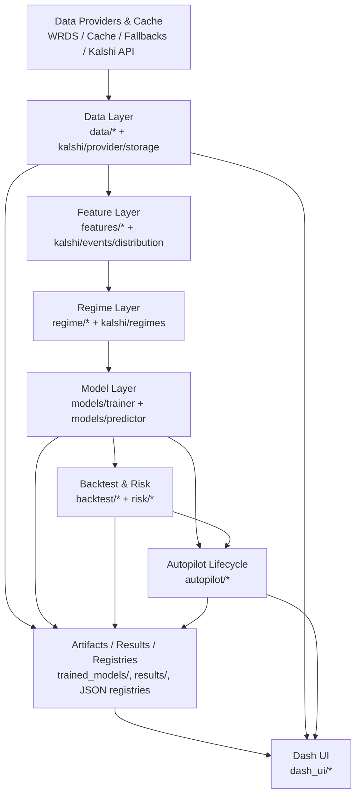

# System Architecture and Flows

## What This Document Covers

This document explains how `quant_engine` is structured as a system, how data and decisions flow through it, and why the major subsystems are separated the way they are.

For exhaustive component listings, use:
- `../reference/SOURCE_API_REFERENCE.md`
- `../reports/QUANT_ENGINE_SYSTEM_INTENT_COMPONENT_AUDIT.md`

## System Purpose (Architecture View)

`quant_engine` combines research, validation, strategy lifecycle management, and UI observability into one repository.
The architecture is intentionally layered so that:
- data concerns stay separate from modeling concerns,
- modeling stays separate from execution simulation,
- promotion/governance stays separate from raw performance,
- event-market research (Kalshi) stays isolated but can reuse validation standards,
- UI can consume artifacts/results without owning core strategy logic.

## High-Level Architecture (Layered)

## Primary System Flows

### 1. Equity Research / Strategy Flow

1. `run_train.py`
- Loads historical data via `data.loader`
- Builds feature panels via `features.pipeline`
- Builds regime features via `regime.detector` and correlation regime detector
- Trains/version models via `models.trainer`

2. `run_predict.py`
- Resolves model version/champion
- Rebuilds features/regimes for latest data
- Produces predictions + confidence + regime-aware outputs via `models.predictor`

3. `run_backtest.py`
- Converts predictions into simulated trades via `backtest.engine.Backtester`
- Applies execution assumptions and risk controls
- Produces performance/validation outputs and diagnostics

### 2. Strategy Lifecycle / Autopilot Flow

1. `run_autopilot.py`
- Ensures predictor baseline exists (or uses fallback heuristic predictor)
- Builds latest and/or walk-forward OOS predictions
- Generates execution-parameter strategy candidates (`autopilot.strategy_discovery`)
- Evaluates candidates with backtest + advanced validation
- Applies promotion gating (`autopilot.promotion_gate`)
- Persists active strategies (`autopilot.registry`)
- Runs paper execution (`autopilot.paper_trader`)

Why this is separate from training:
- It evaluates strategy deployment behavior and robustness, not just model fit quality.

### 3. Kalshi Event-Market Research Flow

1. `run_kalshi_event_pipeline.py`
- Ingests Kalshi markets/contracts/quotes with signed client + provider + event-time storage
- Reconstructs distribution snapshots from contract quotes (`kalshi.distribution`)
- Builds leak-safe event feature panels (`kalshi.events`)
- Runs event walk-forward evaluation (`kalshi.walkforward`)
- Applies event promotion checks via `kalshi.promotion` + shared promotion gate

Why this subsystem is isolated:
- Contract/quote/distribution/event timing semantics are materially different from the equity stack.

### 4. UI / Observability Flow

`run_dash.py` launches the Dash app (`dash_ui`).

The UI consumes:
- artifacts and model outputs,
- results and diagnostics,
- health summaries,
- backtest outputs,
- autopilot/paper-trading state,
- Kalshi outputs,
- and on-demand live calculations / demos.

Why the UI is decoupled:
- UI changes should not alter core research/execution behavior.
- Core workflows remain scriptable without the UI.

## Why the Packages Are Separated

- `data/`: source normalization, caching, survivorship-safe loading
- `features/`: feature definitions and panel assembly
- `regime/`: market state context generation
- `models/`: training, inference, versioning, governance
- `backtest/`: trade simulation and validation
- `risk/`: reusable risk components and analytics
- `autopilot/`: strategy lifecycle orchestration
- `kalshi/`: event-market vertical (ingest + feature + eval + promotion)
- `dash_ui/`: human interface only

## Artifact and State Boundaries

Key persisted state locations (from config + runtime conventions):
- `trained_models/`: model artifacts + registries
- `results/`: backtest/prediction/autopilot outputs
- `data/cache/`: local data cache and metadata sidecars
- `data/kalshi.duckdb` (or configured path): Kalshi event-time research store
- autopilot registry/paper state JSONs (paths defined in `config.py`)

Why this matters:
- It allows script-driven workflows and the UI to share a common persisted state without direct process coupling.

## Architecture Design Goals (Observed in Source)

- Correctness over convenience (identity/time alignment guards)
- Graceful fallback behavior for missing providers/dependencies
- Research reproducibility via artifact registries and manifests
- Promotion discipline (quality gates > raw backtest performance)
- Modularity for extending one subsystem without rewriting the system
